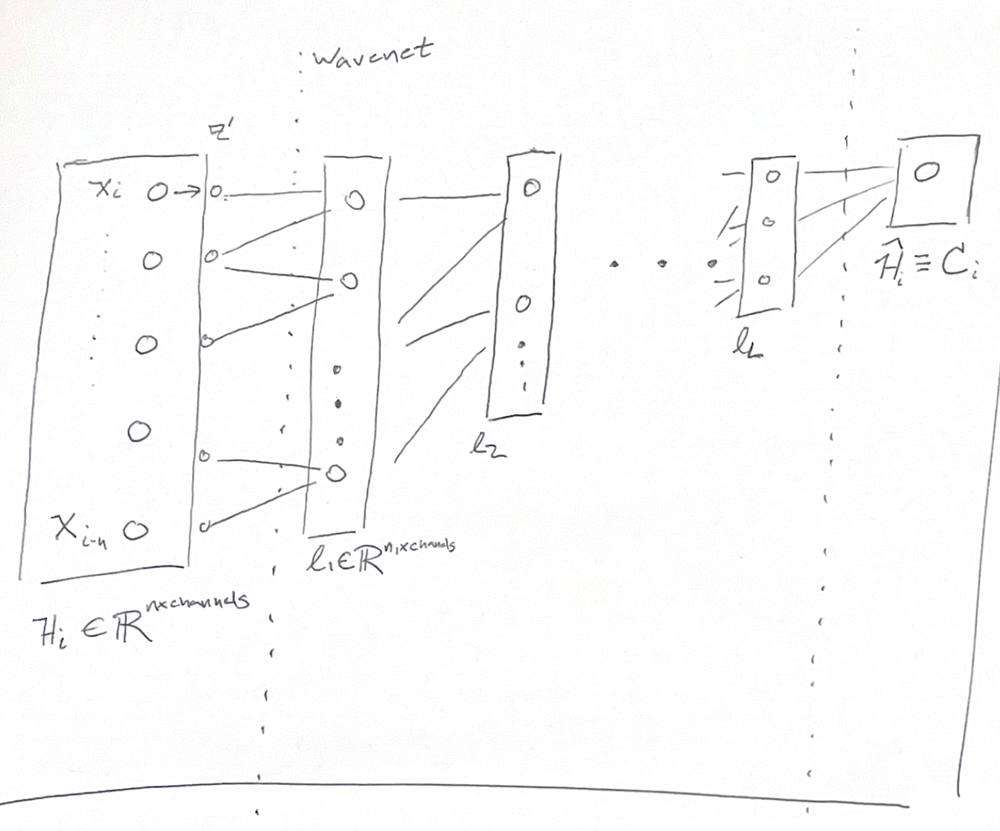

# Information bottleneck and CPC

$H =$ history vector of concatenated observations

$NN =$ embedding network + context network

$C \equiv \hat{H} =$ context/minimal sufficient statistics

---

## Information Bottleneck

- There exists a structured dist:

  $p(Hᵢ, Xᵢ₊₁)$
- Relevant info in history

  $Hᵢ ≡ I(Hᵢ; Xᵢ₊₁)$
- $Ĥ$ = minimal sufficient statistics, = simplest mapping of H that captures $I(Hᵢ, Xᵢ₊₁)$
- Best representation found by minimizing

  $\ell [p(Ĥ|H)] = I(H; Ĥ) − β(I(Ĥ; Xᵢ₊₁))$
  - “compressive”
  - “predictive info preserving”
- Data processing inequality:

  $I(H, Xᵢ₊₁) ≥ I(Ĥ, Xᵢ₊₁) ≥ I(X̂ᵢ₊₁, Xᵢ₊₁)$
- Rate distortion theory:
  How much can you compress input & maintain a distortion ≤ D on reconstruction?

## Distortion Measure

- distortion

  $d(H, Ĥ) = KL[ p(Xᵢ₊₁ | Hᵢ) ∥ p(Xᵢ₊₁ ∥ Ĥ) ]$
- When Ĥ is a optimized sufficient statistic:

  $E[d(H, Ĥ)] = I(Hᵢ; Xᵢ₊₁ | Ĥ)$

  - Residual info in history not captured by Ĥ
  - Want to reduce this value

- Rewrite the loss:

  $L = I(H; Ĥ) + β(I(H; Xᵢ₊₁ ∥ Ĥ))$

  - First term: “compression”
  - Second term: “residual information”

- IB Distortion

  $Dₙ = I(Hᵢ; Xᵢ₊₁ ∥ X̂ᵢ₊₁)$

- Representational Complexity of Output

  $Rₙ = I(Hᵢ; X̂ᵢ₊₁)$

## Connecting to Wavenet

- Xᵢ₋₍ᵢₙ₎ → (layers) → Zᶫ → … → Hᵢ ∈ ℝⁿˣchannels
- Hᵢ → Cᵢ ∈ ℝⁿˣchannels (context-dim)

### IB Goals

1. Minimize $I(Hᵢ; Cᵢ)$
2. Maximize $I(Cᵢ; Xᵢ₊₁)$ OR minimize $I(Hᵢ; Xᵢ₊₁ ∥ Cᵢ)$

### CPC Training

- Maximizes lower bound of $I(Xₜᵣⱼ; Cᵢ)$
  - Compatible with IB (2.)
- Reduces information bottleneck distortion.
- Architecture and dimensionality constrains representational complexity
  - Compatible with IB (1.)

# Considering dimensionality

- Tishby, Zavlasky 2015

Dimensions
---

$H = n_{lag} * n_{electrodes}$

$Z = n_{lag} * dim_{latent}$

$wavenet\ layers = xxx$

$C = dim_{context}$

Choosing values
(or How I learned to stop fearing and love dimensionality)
---

- each layer loses predictive information
- compressing too much too early makes later prediction hard
- compressing too much in final context dimension means can't store all

Empirical Rules of thumb:

- $n_{lag}$ should correspond to ~500-1000ms
- Consider Taken's theorem
  - $n_{lag} \ge 2m +1$
  - $m =$ dimensionality of the generative function
- $dim_{latent} ~$ quarter - half the input dimensionality
  - may be larger than the dimensionality of a given shank!
